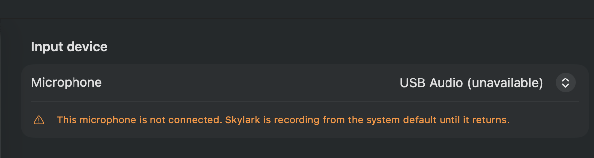

# Skylark v1 human-pass findings

- **Run:** 2026-09-08 on JJ's MacBook Air
- **Source:** `docs/qa/v1-human-pass.md`
- **Commit:** `63b3c304297485b4f7510c145d3cdb0d1940f6b8`
- **Installed app:** Skylark 0.21.1 (build 45)

## Preflight

- `main` matched `origin/main` before installation.
- `Scripts/install.sh` built, signed, installed, and launched the app from
  `/Applications/Skylark.app`.
- The gate document expected 0.21.0, but the current build identifies itself as
  0.21.1. This is a documentation mismatch, not a product failure.
- History baseline: row 1848 was the newest row before this pass.
- Seventeen pre-existing Skylark crash reports were moved out of
  `~/Library/Logs/DiagnosticReports/` before the pass so new crashes would be
  unambiguous. No new report appeared during testing; the 17 old reports were
  restored afterward.
- A content-free Skylark log stream was started before testing.
- The initial audio check found only MacBook Air Microphone and JJ-iPhone
  Microphone. After JJ attached the test device, macOS listed `USB Audio` and
  selected it as the active input. Skylark has no custom-device override saved,
  so it is using that system-default USB input.

## Block 1: Push-to-talk on bare Fn

**Verdict:** **FAIL, release-blocking**

| ACT | Observation | History evidence |
|---|---|---|
| 1. Fixed sentence | PASS. The full sentence landed in TextEdit with no missing words. | Row 1849, Parakeet, 461 ms latency |
| 2. Long sentence | PASS. The complete utterance landed. The recording was 17.7 seconds rather than the requested eight seconds; that does not weaken the hold test. Cleanup only hyphenated “eight-second-long.” | Row 1850, Parakeet, 292 ms latency |
| 3. One word | PASS. `John.` landed. | Row 1851, Parakeet, 175 ms latency |
| 4. Three-second silent hold | **FAIL, reproduced 2/2.** JJ said nothing in either attempt, but Skylark inserted `Yeah.` both times. The pill expanded and displayed the waveform instead of the required `No speech detected` note. | Row 1852: 2,383 ms retained audio and 227 ms latency. Row 1853: 677 ms retained audio and 202 ms latency. Parakeet produced `Yeah.` for both. The first attempt's VAD log reported `regions: 0`, but transcription and insertion still ran. |
| 5. Speak before the pill appears | **FAIL.** Repeated early-start attempts never produced the requested phrase faithfully. Visible output added an unspoken `The`: `The early bird catches the worm.` | Rows 1855–1859. Raw Parakeet outputs included `The bird catches the worm.`, `Early a bird catches the worm.`, and three instances of `Earlier bird catches the worm.` Cloud cleanup rewrote four attempts to `The early bird catches the worm.`, adding `The`. |
| 6. Quick Fn tap | PASS. The pill stopped and the app did not remain in recording mode. | No stuck state reported; no extra history row attributable to the quick tap. |
| 7. Fn+Right Arrow passthrough | PASS. End and Home navigation both overrode Skylark's Fn hotkey. Starting with `START middle END`, the resulting `YSTART middle ENDX` proved that Fn+Right moved to the end and Fn+Left moved to the beginning. | JJ reported that both shortcuts worked. |

The median end-of-speech-to-paste latency across ACTs 1–3 was **292 ms**, inside
the 300 ms bar. The database `latency_ms` values matched the corresponding log
totals after integer rounding. ACT 1 was individually over the bar at 461 ms,
but the gate defines the measurement as the median.

The silent-hold failure is not an ambiguous visual judgment. Both inserted words
persisted in history, and JJ confirmed that row 1853 came from a second deliberate
silent hold. This is a 2/2 reproduction on the selected USB input.

After the first three TextEdit checks, JJ dictated directly into ChatGPT to
reduce relay overhead. History and pipeline logs remained the ground truth for
raw versus cleaned text. This exposed a second defect in ACT 5: Parakeet
misrecognized the opening phrase and cleanup then inserted an article JJ had not
spoken. The visible sentence looked grammatical but was not faithful to the
audio.

## Block 2: Visible status notes

**Verdict:** Skipped by owner direction

JJ confirmed that the pill expanded normally when Fn was pressed. The specific
status-note and novice-wording checks were skipped because they duplicate normal
day-to-day use and JJ asked to concentrate the prepared hardware session on
unusual stress paths.

## Block 3: Microphone cable

**Verdict:** **PASS**, with an iPhone continuity side effect noted

| ACT | Observation | Evidence |
|---|---|---|
| 1. Unplug selected USB mic | PASS. The pill showed `Selected mic unavailable, using the system default.` The log reported `selected input device absent; falling back to system default`. | JJ's visual report and device log at 23:53:43 |
| 2. Dictate while unplugged | PASS. `This sentence is using the fallback microphone.` landed in ChatGPT and Skylark did not crash. | History row 1866, Parakeet, 3,079 ms audio |
| 3. Reconnect USB mic | PASS. The pill showed `Selected mic is back - using USB Audio`. | JJ's visual report; log reported `selected input device returned; re-adopting it` |
| 4. Dictate after reconnect | PASS for device recovery. `This sentence is using the restored USB microphone.` landed. CoreAudio read-back matched exactly: `requested 140 engine now 140`; no `MISMATCH`. | History row 1867, Parakeet, 3,498 ms audio |
| 5. Unavailable-device state | PASS. Settings retained `USB Audio (unavailable)` and explicitly said Skylark was recording from the system default until it returned. | Screenshot below |
| 6. Change device during capture | PASS against the written gate. Unplugging mid-sentence preserved `These words were spoken before.` and Skylark neither crashed nor stuck. A converse test that began unplugged and reconnected USB mid-sentence preserved the full `These words were spoken before, and these words were spoken after.` | Rows 1869 and 1870. Reconnect during capture logged `configurationChange` at 4.66 s, `recording continues`, then `interrupted: true [configurationChange]`. CoreAudio read-back matched `requested 156 engine now 156`; no `MISMATCH`. |

**Incidental finding during ACT 4:** the cloud cleanup attempt failed or timed
out and Skylark degraded to `local:apple`. The faithful raw sentence still
landed, but only after 6,582 ms total latency, including 6,376 ms in cleanup.
JJ saw the cloud-cleanup failure notice. The log does not distinguish provider
failure from timeout.

**Incidental finding during ACT 6:** when the selected USB mic was unplugged,
macOS unexpectedly activated JJ's iPhone as the MacBook's default continuity
microphone. JJ called this a weird glitch worth recording. The behavior appears
to originate in macOS device selection, not Skylark, but it disrupts the intended
fallback experience. Skylark still met this block's explicit acceptance rule by
retaining the words spoken before the unplug.

## Block 4: Quit with Qwen3 4B loaded

**Verdict:** **PASS** for the crash gate; separate first-use reliability failure

- Qwen3 4B was already downloaded and selected as the engine that backs the
  Local cleanup tier.
- The app logged `llama model loaded (n_ctx=4096)` and measured 3,051,008 KiB
  RSS, about 2.91 GiB, proving the 4B model was resident.
- The first setup dictation did not count toward the quit cycles because the
  active cleanup tier remained Cloud. History row 1872 shows cleanup engine
  `meta-llama/llama-3.3-70b-instruct`, not Qwen.
- After the tier changed to Local, row 1873 used
  `local:qwen3-4b-instruct`. The Qwen cleanup log reported 1,646 ms and RSS was
  3,123,632 KiB, about 2.98 GiB, immediately before the first quit.

| Quit cycle | Qwen proof before next quit | RSS | New crash reports |
|---|---|---:|---:|
| 1 | Row 1874 used `local:qwen3-4b-instruct`; the prior process logged `quit: local cleanup model unloaded before exit` | 2,133,136 KiB (2.03 GiB) | 0 |
| 2 | Row 1875 used `local:qwen3-4b-instruct`; cycle 1's process logged a clean model unload | 3,147,152 KiB (3.00 GiB) | 0 |
| 3 | Rows 1876–1877 used `local:qwen3-4b-instruct`; cycle 2's process logged a clean model unload | 3,148,544 KiB (3.00 GiB) | 0 |
| 4 | First cleanup degraded to Apple; immediate retry used `local:qwen3-4b-instruct`; cycle 3's process logged a clean model unload | 3,112,448 KiB (2.97 GiB) | 0 |
| 5 | Row 1880 used `local:qwen3-4b-instruct`; cycle 4's process logged a clean model unload | 3,154,032 KiB (3.01 GiB) | 0 |

Cycle 1's short phrase was transcribed as `Quen quit cycle one.` rather than
`Qwen`, an accuracy miss. RSS was lower than the approximate 3 GiB target after
relaunch, but the load and cleanup logs prove that Qwen was resident and ran.
Cycle 2 transcribed the same name as `Quan`; cycles 3 and 4 transcribed it as
`Quinn`.

**Reliability finding in cycle 4:** the first Qwen cleanup after relaunch failed
or timed out and Skylark showed the local-cleanup failure note, then degraded to
Apple Intelligence. Row 1878 records `cleanup_engine=local:apple` with 7,253 ms
total latency, including 6,768 ms in cleanup. This fallback was per-dictation,
not a permanent setting change: defaults still selected
`llama:qwen3-4b-instruct`, and an immediate retry in row 1879 succeeded with
Qwen in 1,069 ms total.

All five loaded-model quits completed without a new `Skylark-*.ips` report.
Each departing process logged that the local cleanup model unloaded before exit.
The original intermittent quit-crash gate therefore passes, while the cycle 4
first-use failure remains a separate actionable finding.

## Block 5: Real speech

**Verdict:** **FAIL**, non-gating accuracy findings

Normal real speech was exercised throughout the pass by dictating directly into
ChatGPT. The targeted edge cases produced these results:

| Test | Visible result | Raw versus cleaned evidence |
|---|---|---|
| Custom dictionary | Partial. `claude.md` and `Claude` were recognized, but the file name did not retain the dictionary entry's exact `CLAUDE.md` capitalization. | Row 1881 raw: `Please update claude.md and ask claude to review it.` Qwen capitalized only the second `Claude`. |
| Spoken GitHub URL | **FAIL.** It remained `Github dot com slash j j Romano slash skylark.` instead of becoming a usable URL. | Row 1882. Qwen logged an 838 ms result, but the pipeline later logged `timeout→raw kept for paste target`; total latency was 3,817 ms. |
| Spoken email address | **FAIL.** It became `J. Jromano@example.com.` instead of `jjromano@example.com`. | Row 1883 raw: `J Jromano at example dot com.` Qwen joined the address but preserved the incorrect token boundary and capitalization. |
| Two-second thinking pause plus stressed `really` | **FAIL, 1/2.** The pause did not end the recording, but the first visible result became `The deployment is ready for production.`, deleting the stressed word. An immediate retry kept it. | Row 1884 raw contained `really`; Qwen removed it in clean text. Row 1885 retained it. This is cleanup deletion, not an ASR miss. |

No spoken numbers appeared in these cases, so there was no numeric value change
to flag.

## Block 6: Onboarding

**Verdict:** Skipped by owner direction

The permission-reset onboarding check was skipped because it is a basic novice
flow rather than an unusual runtime stress path.

## Is this a v1.0?

**No.** The bare-Fn gate has two release-blocking failures on real hardware. A
silent hold fabricated and inserted `Yeah.` twice in two attempts even though
VAD logged zero speech regions. Early-start dictations also failed to preserve
the requested opening phrase faithfully, and cleanup added an unspoken `The`.
The physical microphone block passed, including fallback, recovery, and
mid-capture device changes. The historic Qwen quit crash did not reproduce in
five loaded-model quits and produced zero crash reports, but one first cleanup
after relaunch failed over to Apple Intelligence and took 7.25 seconds. Further
non-gating speech checks found malformed spoken addresses and a Qwen cleanup
that deleted a correctly transcribed stressed word on one of two attempts.
Blocks 2 and 6 were skipped at JJ's direction because this session prioritized
unusual stress paths over familiar status and onboarding flows.
